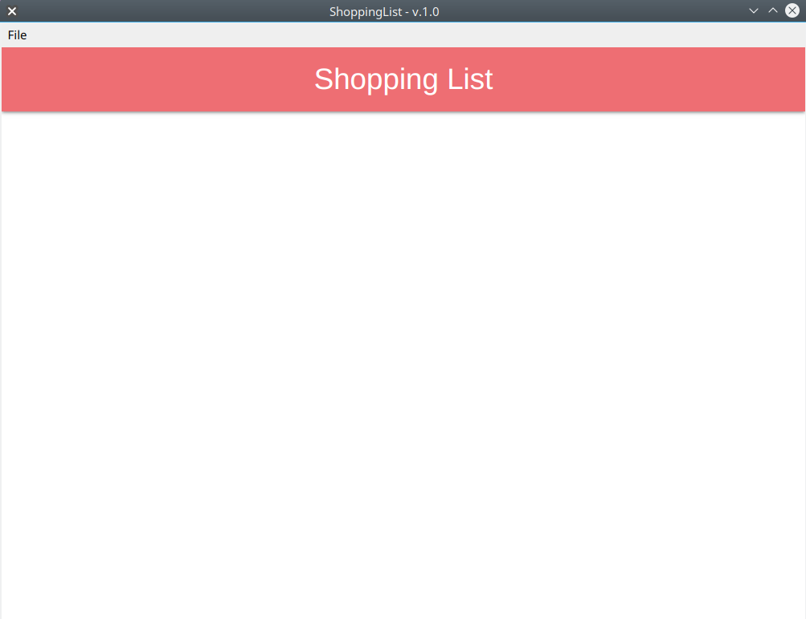
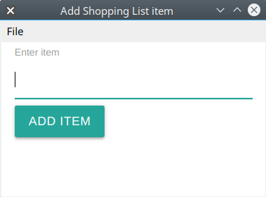
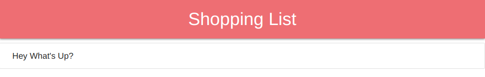
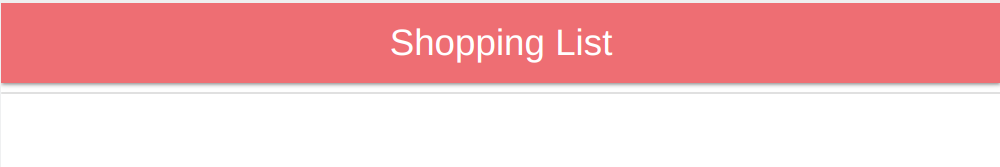

# Shopping List

Hey guys, god Bless! yeah, i know that i was inactive but don't worry! I'm here again, at this time, im gonna show they my last project, 
with this technology, Yeah! Electro.js

## Shopping List: Start

at this part, you can see the main part of our app, so in this part you have only, the default top var and a adition of it, a lower-level bar.
You can ue it to do some actions!

## Shopping List: Add Menu

After you open the app you could to do some actions like:

  * Add some items to the list
  * Clear all  
  * Or quit the app. (also you can use "Ctrl+Q" or "Command+Q")

When you click the add menu, the app displays a mini window with an input and a button, you can enter anything.

## Shopping List: When there is a item or more than one item:

If you write some items or an item, you can always delete this or those item/s, you have to ways to perform these actions:

  * Double click in the specific item
  * Or go to the file tab, and click in clear!
 
You'll see this if you drop all items

 * On3l7d15h
 * This project was posible by https://github.com/bradtraversy.
